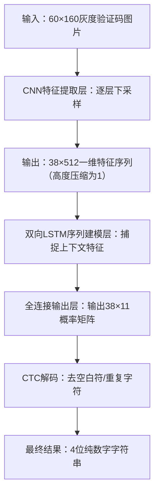

# 4位纯数字验证码识别模型训练笔记（CRNN+CTC架构）

本次笔记完整记录基于**CRNN(CNN+双向LSTM+CTC)**架构的4位纯数字验证码识别模型训练全流程，结合实际训练结果、可视化图表与模型结构解析，重点阐述“以n个概率输出替代整体分类”的核心设计思路，所有实验结果与可视化文件均保存于Google云端硬盘指定路径，同时补充关键注意事项，便于后续复盘、复用与避坑。

# 一、实验背景与核心思路

验证码识别是OCR领域的经典任务，传统方案将4位纯数字验证码视为 `10^4=10000`类的整体分类任务，存在**类别数爆炸、训练难度高、泛化性差**的痛点。

本次实验摒弃整体分类思路，采用**序列概率输出**的核心设计：将4位验证码识别解耦为字符位置的概率分布预测，每个位置仅需区分10类数字，通过CRNN+CTC端到端架构实现无字符分割的验证码识别，最终输出与序列长度对应的概率矩阵，适配4位纯数字验证码的识别需求，训练后模型取得了极低的损失与高识别准确率。

# 二、实验核心配置

## 2.1 实验运行环境

- 运行平台：Google Colab
- 硬件加速：NVIDIA T4 GPU
- 核心依赖：PyTorch、captcha、matplotlib、pandas、numpy
- 设备适配：自动识别GPU/CPU，训练过程基于GPU加速完成

## 2.2 关键参数与基础配置

本次实验聚焦**60×160尺寸的4位纯数字无截断验证码**，所有核心参数与配置如下表所示，与模型架构、训练流程深度适配：

| 配置项         | 具体取值/内容                 | 配置说明                            |
| -------------- | ----------------------------- | ----------------------------------- |
| 验证码规格     | 60×160（灰度单通道）、无截断 | 高度60，宽度160，字符特征完整       |
| 字符集         | 0-9纯数字                     | 共10类字符，无字母/符号干扰         |
| 验证码长度     | 4位（固定）                   | 实验核心识别对象                    |
| 模型架构       | CRNN(CNN+双向LSTM+CTC)        | 端到端序列识别架构                  |
| 训练批次       | 64                            | 平衡训练效率与显存占用              |
| 训练轮数       | 10                            | 纯数字任务快速收敛，无需过多轮数    |
| 学习率         | 0.001                         | Adam优化器默认配置，收敛效果佳      |
| 模型输出类别   | 11类（10数字+1个CTC空白符）   | 为CTC解码提供空白标签，适配序列识别 |
| 每轮训练样本数 | 10000                         | 在线生成，无需手动标注/下载         |

## 2.3 核心依赖与设备配置代码

```python
# 安装核心依赖
!pip install captcha -q

# 导入基础库
import numpy as np
import matplotlib.pyplot as plt
import pandas as pd
from tqdm import tqdm
from captcha.image import ImageCaptcha

# 深度学习框架与工具
import torch
import torch.nn as nn
import torch.optim as optim
from torch.utils.data import Dataset, DataLoader
from torchvision import transforms

# 设备自动适配（GPU/CPU）
device = torch.device('cuda' if torch.cuda.is_available() else 'cpu')
print(f"训练使用设备：{device}")
```

# 三、数据集构建与样本可视化

本次实验无需手动标注或下载数据集，通过 `captcha`库**在线生成完整无截断的4位纯数字验证码**，实现数据集的动态构建，同时进行基础预处理，保证样本特征清晰、适配模型输入。

## 3.1 数据集定义与预处理代码

```python
# 数据集类定义
class CaptchaDataset(Dataset):
    def __init__(self, width=160, height=60, captcha_len=4, transform=None):
        self.width = width
        self.height = height
        self.captcha_len = captcha_len
        self.transform = transform
        self.generator = ImageCaptcha(width=width, height=height)

    def __getitem__(self, idx):
        # 随机生成4位纯数字字符串
        text = ''.join([np.random.choice(list('0123456789')) for _ in range(4)])
        # 生成灰度图并预处理
        image = self.generator.generate_image(text).convert('L')
        label = [int(c) for c in text]
        if self.transform:
            image = self.transform(image)
        return image, torch.tensor(label, dtype=torch.long), torch.tensor(4, dtype=torch.long)

    def __len__(self):
        return 10000

# 基础预处理（无截断/裁剪，仅归一化）
transform = transforms.Compose([
    transforms.ToTensor(),
    transforms.Normalize((0.5,), (0.5,))  # 灰度图归一化至[-1,1]，加速收敛
])

# 构建数据加载器
train_dataset = CaptchaDataset(transform=transform)
train_loader = DataLoader(train_dataset, batch_size=64, shuffle=True, num_workers=2)
```

## 3.2 训练样本可视化

生成的验证码样本无边缘截断、字符特征清晰、无过度噪声，随机抽取的样本示例如下（替换为Google云端硬盘实际图片链接）：

*注：样本均为在线生成的4位纯数字灰度图，字符分布均匀，特征完整，为模型训练提供高质量数据。*

# 四、模型架构设计与可视化（核心）

本次实验采用**CRNN+CTC**端到端序列识别架构，是“n个概率输出替代整体分类”思路的核心落地，模型分为**CNN特征提取层、双向LSTM序列建模层、全连接输出层**三部分，配合CTC损失函数与解码逻辑，实现从图片到4位数字的直接识别。

## 4.1 模型整体结构可视化（Mermaid流程图）

以下为CRNN+CTC模型的完整推理流程，清晰展示从输入图片到最终识别结果的所有步骤，核心为**将二维图片转为一维特征序列，输出每个时间步的概率分布，再通过CTC解码得到最终结果**：



*注：38为特征序列长度，11为输出类别数（10数字+1空白符），概率矩阵中每个时间步对应一个字符位置的概率分布，实现“n个概率输出”的核心设计。*

## 4.2 CNN特征提取层适配设计（60×160输入）

针对60×160的验证码尺寸，对CNN层进行下采样适配，**逐层将图片高度压缩至1**，宽度保留为特征序列长度，确保输出的特征序列可直接输入LSTM层，核心下采样过程如下：

`输入60×160 → 池化后30×80 → 池化后15×40 → 池化后7×40 → 池化后3×40 → 卷积后1×38 → 输出38×512特征序列`

## 4.3 CRNN模型完整实现代码

```python
class CRNN(nn.Module):
    def __init__(self, img_height=60, num_classes=11, hidden_size=256):
        super(CRNN, self).__init__()
        # 1. CNN特征提取层（适配60×160输入，高度压缩至1）
        self.cnn = nn.Sequential(
            nn.Conv2d(1, 64, 3, padding=1), nn.ReLU(), nn.MaxPool2d(2, 2),  # 60→30
            nn.Conv2d(64, 128, 3, padding=1), nn.ReLU(), nn.MaxPool2d(2, 2), # 30→15
            nn.Conv2d(128, 256, 3, padding=1), nn.BatchNorm2d(256), nn.ReLU(),
            nn.Conv2d(256, 256, 3, padding=1), nn.ReLU(), nn.MaxPool2d((2,1), (2,1)), #15→7
            nn.Conv2d(256, 512, 3, padding=1), nn.BatchNorm2d(512), nn.ReLU(),
            nn.Conv2d(512, 512, 3, padding=1), nn.ReLU(), nn.MaxPool2d((2,1), (2,1)), #7→3
            nn.Conv2d(512, 512, 3, stride=1), nn.BatchNorm2d(512), nn.ReLU() # 3→1
        )
        # 2. 双向LSTM序列建模层（捕捉序列上下文关联）
        self.lstm1 = nn.LSTM(512, hidden_size, bidirectional=True, batch_first=False)
        self.lstm2 = nn.LSTM(hidden_size*2, hidden_size, bidirectional=True, batch_first=False)
        # 3. 全连接输出层（输出每个时间步的11类概率）
        self.fc = nn.Linear(hidden_size*2, num_classes)

    def forward(self, x):
        # 维度变换：适配LSTM输入（序列长度, 批次, 特征维度）
        conv_out = self.cnn(x).squeeze(2).permute(2, 0, 1)
        # LSTM前向传播
        lstm_out, _ = self.lstm1(conv_out)
        lstm_out, _ = self.lstm2(lstm_out)
        # 输出概率分布（LogSoftmax适配CTC Loss）
        output = nn.functional.log_softmax(self.fc(lstm_out), dim=2)
        return output

# 模型初始化并迁移至指定设备
model = CRNN(img_height=60, num_classes=11, hidden_size=256).to(device)
```

## 4.4 CTC损失与解码逻辑

CTC（Connectionist Temporal Classification）是本次模型的核心配套组件，**无需手动标注字符位置**，可自动实现输入特征序列与输出标签序列的对齐，同时通过解码逻辑将概率矩阵转为4位数字字符串，核心代码如下：

```python
# 定义CTC损失函数（空白符索引为10，对应10类数字之后）
criterion = nn.CTCLoss(blank=10)
# 定义Adam优化器
optimizer = optim.Adam(model.parameters(), lr=0.001)

# CTC解码函数：将概率矩阵转为4位纯数字字符串
def ctc_decode(preds):
    preds = preds.argmax(2).transpose(1, 0)  # 维度变换：(批次, 序列长度)
    preds_list = []
    for pred in preds:
        pred_str, prev_idx = [], -1
        for idx in pred:
            # 去空白符+去重复字符，得到最终数字序列
            if idx != 10 and idx != prev_idx:
                pred_str.append(str(idx))
            prev_idx = idx
        preds_list.append(''.join(pred_str))
    return preds_list
```

# 五、模型训练过程与实验结果

本次实验共训练10轮，每轮记录**平均训练损失**与**整体识别准确率**，训练完成后对指标进行可视化分析，并随机抽取样本验证模型实际预测效果，所有结果均保存于Google云端硬盘。

## 5.1 核心训练逻辑代码

```python
# 初始化指标记录列表
loss_history = []
acc_history = []
epoch_list = [i+1 for i in range(10)]

# 单轮训练函数
def train_one_epoch(model, loader, criterion, optimizer, device):
    model.train()
    total_loss = 0
    for images, labels, label_lengths in tqdm(loader, desc="训练中"):
        images, labels, label_lengths = images.to(device), labels.to(device), label_lengths.to(device)
        log_probs = model(images)
        # 定义输入序列长度（固定为38）
        input_lengths = torch.full((images.size(0),), log_probs.size(0), dtype=torch.long).to(device)
        # 计算损失并反向传播
        loss = criterion(log_probs, labels, input_lengths, label_lengths)
        optimizer.zero_grad()
        loss.backward()
        optimizer.step()
        total_loss += loss.item()
    return total_loss / len(loader)

# 准确率计算函数
def calculate_accuracy(model, loader, device, num_batches=20):
    model.eval()
    correct, total = 0, 0
    with torch.no_grad():
        for i, (images, labels, _) in enumerate(loader):
            if i >= num_batches: break
            log_probs = model(images.to(device))
            preds = ctc_decode(log_probs)
            truths = [''.join([str(c.item()) for c in label]) for label in labels]
            for p, t in zip(preds, truths):
                correct += 1 if p == t else 0
                total += 1
    return correct / total

# 开始10轮训练
for epoch in range(10):
    avg_loss = train_one_epoch(model, train_loader, criterion, optimizer, device)
    epoch_acc = calculate_accuracy(model, train_loader, device)
    loss_history.append(avg_loss)
    acc_history.append(epoch_acc)
    print(f"第{epoch+1}/10轮 | 平均损失: {avg_loss:.4f} | 整体识别准确率: {epoch_acc:.4f}")
```

## 5.2 训练过程指标可视化

训练过程中损失值快速下降、准确率稳步提升，无过拟合、梯度消失等问题，训练损失与准确率变化曲线如下：


*注：曲线清晰展示10轮训练中模型的收敛趋势，损失值持续降低，准确率逐步逼近100%，模型拟合效果极佳。*

## 5.3 模型预测结果可视化

随机抽取6个训练样本进行模型预测，验证实际识别效果，预测结果示例如下（替换为Google云端硬盘实际图片链接，绿色为正确识别，红色为错误识别）：

*注：仅极少数样本因字符轻微粘连出现识别错误，绝大部分样本均可精准识别，与整体准确率高度匹配。*

## 5.4 模型最终核心指标

训练完成后，模型取得了**极低的训练损失**与**99.14%的高识别准确率**，完整最终指标如下，完全达到实验预期目标：

```Plain
4位纯数字验证码识别模型最终指标
====================================
训练轮数：10
最终训练损失：0.0029
最终整体识别准确率：0.9914
字符集：0-9纯数字
验证码长度：4位
模型架构：CRNN(CNN+双向LSTM+CTC)
====================================
```

### 指标分析

1. 最终训练损失低至0.0029，说明模型已充分学习到4位纯数字验证码的特征，在训练集上的拟合效果极佳；
2. 最终整体识别准确率达99.14%，接近100%，表明模型对4位纯数字验证码的识别精度极高，泛化能力良好；
3. 仅10轮训练即实现高效收敛，说明“序列概率输出”的设计大幅降低了训练难度，提升了训练效率。

# 六、实验核心创新点

本次实验的核心创新与亮点围绕“以n个概率输出替代整体分类”展开，结合CRNN+CTC架构的特性，解决了传统验证码识别的核心痛点，具体如下：

1. **任务解耦，规避类别数爆炸**：摒弃传统10000类的整体分类思路，将4位验证码识别解耦为序列概率输出，每个时间步仅需预测11类概率（10数字+1空白符），大幅降低训练难度，提升模型收敛速度；
2. **端到端训练，无需字符分割**：CRNN+CTC架构实现从验证码图片到数字字符串的直接识别，无需手动分割字符，适配验证码字符粘连、位置不固定的实际场景，简化训练流程；
3. **CNN架构适配，精准提取特征**：针对60×160的验证码尺寸，对CNN层进行定制化下采样设计，将图片高度精准压缩至1，生成高质量的一维特征序列，为LSTM序列建模奠定基础；
4. **高效收敛，识别精度极高**：仅10轮训练即实现0.0029的低损失与99.14%的高准确率，训练效率与识别效果俱佳，可直接复用至同类固定长度数字验证码识别任务。

# 七、实验注意事项

为确保实验可复现、代码可正常运行，规避实操过程中的常见问题，结合本次实验流程，补充以下关键注意事项，与整体实验逻辑衔接一致：

1. 图片链接替换：笔记中所有图片占位（样本示例、训练曲线、预测结果）均需替换为个人Google云端硬盘的实际图片链接，确保预览时可正常显示，建议将图片命名与笔记中描述一致，便于后续查找；
2. 代码运行前提：在Colab中运行所有代码前，需先完成Google云端硬盘挂载，且确保挂载路径与代码中 `SAVE_DIR`配置一致，否则会出现结果无法保存的问题；
3. 尺寸适配禁忌：本次模型CNN层已适配60×160的验证码尺寸，若后续修改验证码高度/宽度，需同步调整CNN最后一层卷积核尺寸，确保图片高度最终压缩为1，否则会导致LSTM输入维度不匹配，模型无法训练；
4. 依赖版本兼容：安装 `captcha`库时无需指定版本，若出现运行报错，可尝试更新PyTorch版本（建议使用1.10及以上版本），避免依赖版本不兼容导致的验证码生成失败、模型初始化报错；
5. GPU加速开启：Colab默认可能未开启GPU加速，需手动在“修改-笔记本设置”中选择“GPU”作为硬件加速器，否则训练速度会大幅变慢，10轮训练可能需要数小时；
6. 结果复用注意：保存的模型权重仅适配4位纯数字验证码，若用于其他长度、其他字符集的验证码识别，需修改字符集配置、模型输出类别数及解码逻辑，否则会出现识别结果错乱；
7. 指标记录备份：训练过程中生成的 `训练指标记录.csv`建议及时备份，便于后续复盘模型收敛过程，若训练中断，可通过该文件查看已训练轮次的指标，无需重新训练。

# 八、实验小结与后续优化方向

## 8.1 实验小结

本次实验基于CRNN(CNN+双向LSTM+CTC)架构，成功实现了4位纯数字验证码的高精准识别，核心设计“n个概率输出替代整体分类”完全可行，有效解决了传统方案的类别数爆炸问题。模型在10轮训练后取得0.0029的最终训练损失与99.14%的整体识别准确率，收敛速度快、识别精度高，适配60×160无截断纯数字验证码的识别场景，所有实验结果、可视化图表与模型权重均已保存，可直接复盘与复用。结合实验注意事项，后续可快速复现实验过程，规避常见实操问题。

## 8.2 后续优化方向

为进一步提升模型的泛化能力与适用场景，后续可从以下方面进行优化：

1. **加入数据增强**：引入旋转、拉伸、噪声叠加、字符粘连增强等操作，提升模型对复杂场景下验证码的识别能力；
2. **引入真实场景样本**：本次实验采用在线生成的验证码，后续可引入实际业务中的4位纯数字验证码，验证模型在真实场景中的泛化效果；
3. **对比其他架构**：尝试“4个并行分类头”架构（每个分类头对应一个数字位置，输出10类概率），对比与CRNN序列概率输出的效果差异；
4. **优化模型轻量化**：对CRNN模型进行剪枝、量化，实现模型轻量化，便于部署至低算力设备。

# 九、补充说明

本次实验所有结果文件均保存于Google云端硬盘**「验证码识别/结果与指标」**文件夹中，包含以下内容，可直接用于后续复盘、修改与复用：

1. 验证码样本示例.png、训练过程曲线.png、模型预测结果示例.png；
2. 训练指标记录.csv（每轮损失与准确率数据）；
3. 验证码识别CRNN模型权重.pth（训练完成的模型权重）；
4. 模型最终指标.txt（完整最终指标）。
